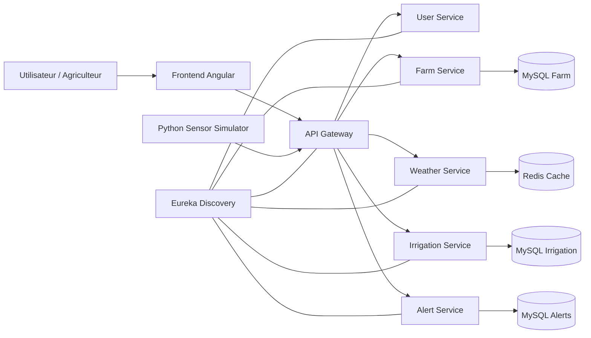
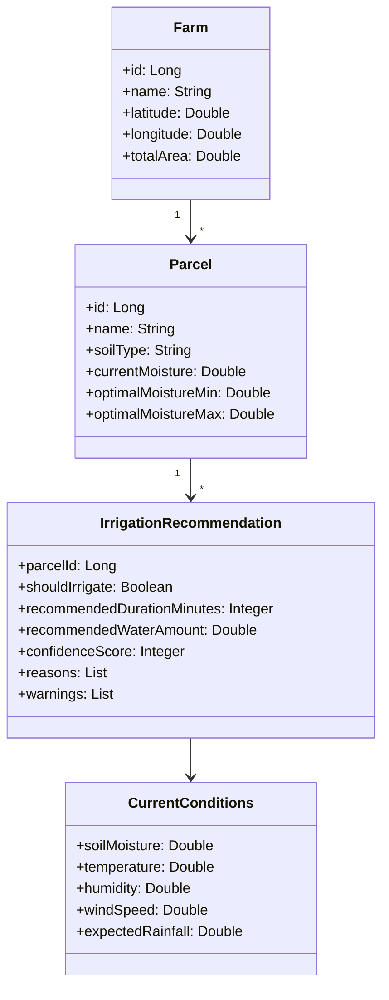

# AquaSmart — Présentation Alternative (Design Soutenance)

> **Thème :** Irrigation intelligente basée sur les données sol + météo + recommandations intelligentes.

---

## 1) Contexte & Problématique

### Problème terrain
- L’irrigation est souvent planifiée de manière fixe, sans tenir compte de l’état réel du sol.
- Résultat : surconsommation d’eau, coûts élevés, et baisse d’efficacité agricole.

### Objectif du projet
- Décider **quand irriguer** et **combien irriguer** par parcelle.
- Utiliser des données mesurées (humidité du sol), la météo, et une logique intelligente.

---

## 2) Proposition de Valeur

AquaSmart permet de :
- centraliser la gestion des fermes et parcelles,
- simuler/collecter l’humidité du sol en continu,
- générer des recommandations d’irrigation fiables,
- visualiser les tendances d’humidité en temps réel.

**Bénéfice métier :** économiser l’eau sans compromettre les cultures.

---

## 3) Stack Technique

### Backend (Microservices)
- Java 17, Spring Boot 3
- Spring Cloud Gateway
- Eureka Discovery
- OpenFeign (inter-service)
- Spring Data JPA
- MySQL 8
- Redis (cache météo)

### Frontend
- Angular 19 (standalone)
- TypeScript
- Nginx (container)

### Data & Simulation
- Python 3 (simulateur capteurs)
- CSV historique (`sensor_history.csv`)
- Docker Compose (orchestration)

---

## 4) Architecture (Vue Macro)



---

## 5) Diagramme de Classes (Domaine Irrigation)



---

## 6) Sécurité & Fiabilité

### Sécurité
- Authentification JWT via gateway.
- Secrets dans `.env` (pas hardcodés).
- Historique Git nettoyé des clés exposées.
- Validation des entrées (ex: humidité entre 0 et 100).

### Résilience
- Recommandation locale disponible même si IA indisponible.
- Cache Redis pour limiter les appels météo externes.
- Découplage microservices via discovery + gateway.

---

## 7) Scénario de Démonstration (Live)

1. Lancer la plateforme Docker.
2. Lancer le simulateur capteurs Python.
3. Observer l’humidité du sol qui évolue par parcelle.
4. Ouvrir une parcelle et cliquer sur **Obtenir conseil**.
5. Afficher la décision : irriguer / ne pas irriguer, durée, eau, confiance.
6. Montrer la courbe d’évolution d’humidité en live sur le frontend.

### Commande démo
```bash
cd AquaSmart-App
python3 simulate_parcel_sensor.py --farm-id 2 --all-parcels --interval-seconds 15 --csv-path sensor_history.csv
```

---

## 8) Résultats Obtenus

- Pipeline complet fonctionnel :
  **Simulation capteur → stockage humidité → analyse météo + sol → décision irrigation → affichage UI**
- Recommandation cohérente avec le niveau d’humidité mesuré.
- Visualisation en temps réel prête pour soutenance.

---

## 9) Limites Actuelles

- Dépendance au quota/modèle IA externe (fallback local actif).
- Historique capteurs actuellement exporté en CSV (pas encore table dédiée).
- Pas encore de bus IoT natif (MQTT/Kafka) dans cette version.

---

## 10) Perspectives (Roadmap)

### Court terme
- Historique persistant en base de données.
- Dashboard graphique (tendances hebdo/mensuelles).
- Traduction complète FR des raisons/avertissements.

### Moyen terme
- Service IoT dédié (ingestion capteurs réels).
- Alertes intelligentes prédictives.
- Optimisation multi-parcelles avec contraintes eau/énergie.

---

## 11) Conclusion

AquaSmart démontre une approche concrète d’**agriculture intelligente** :
- pilotage par la donnée,
- réduction du gaspillage d’eau,
- décision d’irrigation explicable,
- architecture moderne et extensible.

**Message final :** irriguer au bon moment, avec la bonne quantité, sur la bonne parcelle.