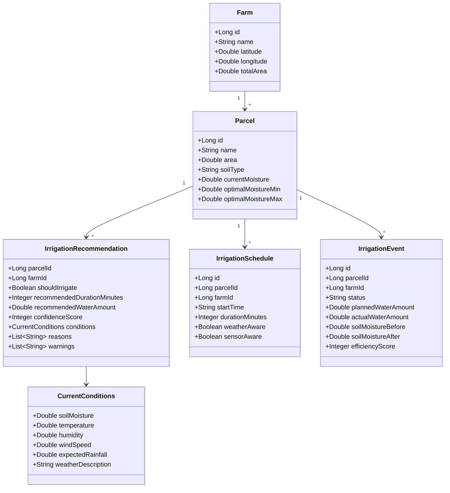

# Présentation du Projet AquaSmart

## 1. Présentation Générale

AquaSmart est une plateforme intelligente de gestion d’irrigation agricole basée sur une architecture microservices.
Le projet aide l’agriculteur à décider si une parcelle a besoin d’eau en combinant:

- les données de parcelle (humidité du sol, type de sol, coordonnées),
- les données météo en temps réel,
- une logique de recommandation intelligente (et un fallback local fiable).

Objectif principal:
**réduire le gaspillage d’eau tout en maintenant une irrigation efficace.**

---

## 2. Technologies Utilisées

### Backend

- Java 17
- Spring Boot 3
- Spring Cloud Gateway
- Eureka Discovery Service
- OpenFeign (communication inter-services)
- Spring Data JPA
- MySQL 8
- Redis (cache météo)
- Docker & Docker Compose

### Frontend

- Angular 19 (standalone components)
- TypeScript
- Nginx (serving en container)

### Simulation & Données

- Python 3 (simulateur de capteurs de parcelles)
- CSV (historique des mesures et recommandations)

---

## 3. Sécurité

Le projet applique des bonnes pratiques de sécurité:

- Authentification JWT (services sécurisés via user-service + gateway).
- Secrets externalisés via variables d’environnement (`.env`) et non hardcodés.
- Clés API sensibles retirées de l’historique Git et protégées.
- Communication centralisée via API Gateway.
- Validation des entrées backend (ex: humidité du sol entre 0 et 100).

Points importants démontrés durant le projet:

- correction d’exposition de secrets dans Docker Compose,
- mise en place d’un fallback robuste si service IA indisponible,
- conservation du fonctionnement métier même en cas de panne partielle.

---

## 4. Diagramme de Classes (Vue Fonctionnelle)



---

## 5. Démonstration du Système

### Scénario Démo

1. Créer/charger une ferme avec plusieurs parcelles.
2. Lancer le simulateur Python pour injecter périodiquement l’humidité du sol (`currentMoisture`).
3. Observer la mise à jour en direct dans le frontend (cartes parcelles + courbe d’évolution).
4. Cliquer sur **Obtenir conseil** pour chaque parcelle.
5. Vérifier la décision:
   - Irrigation recommandée ou non,
   - durée et quantité d’eau,
   - score de confiance,
   - raisons et avertissements.

### Commande de Simulation

```bash
cd AquaSmart-App
python3 simulate_parcel_sensor.py --farm-id 2 --all-parcels --interval-seconds 15 --csv-path sensor_history.csv
```

### Résultat Attendu

- Si l’humidité baisse sous le seuil optimal, le système recommande l’irrigation.
- Si l’humidité est suffisante, il recommande de ne pas irriguer.
- Les décisions restent disponibles même en fallback local (résilience du système).

---

## 6. Conclusion

AquaSmart démontre une approche moderne pour l’agriculture intelligente:

- architecture microservices scalable,
- prise de décision orientée données (sol + météo),
- capacité de simulation réaliste pour tests et soutenance,
- amélioration continue possible (historique, visualisation avancée, IA avec quota actif).

Le projet répond à une problématique réelle: **irriguer mieux, avec moins d’eau et plus de précision.**
